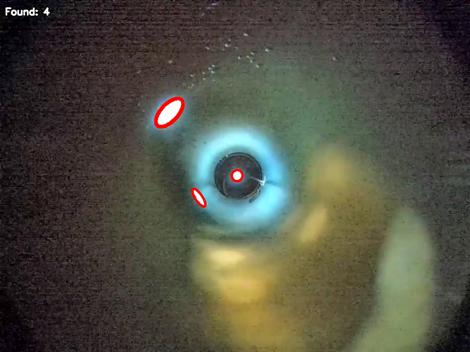

# WRS-2025

---
A solution developed to solve the case of the National Technology Olympiad (Национальная Технологическая Олимпиада) in the profile "Water robotic systems"

---
**Task:** to develop a micro-TNPA that will have a digital camera and an independent control panel in its design. Using the MiddleROVcarrier vehicle, it will be necessary to transport the micro-TNPA to the research site, to determine the type of fouling on the hull of the marine vessel. It is also necessary to investigate the underwater sluice with the help of micro-TNPA, to determine and count the number of damages (holes) in it.

**Stages of project:**
1. Develop micro-TNPA.
2. Develop the design of the micro-TNPA (namely, the method of fixing the camera in the bulb, the method of attaching the mover to the bulb of the micro-TNPA, and the method of transportation).
3. Develop a program for controlling the micro-TNPA using a remote control.
4. Develop a program to process the video stream from the micro-TNPA: a program to classify fouling on the ship and identify damage in the pipe.
5. Carry out the mission. The mission is to investigate the hull of the ship by determining the type of fouling on it, enter the underwater sluice and determine the damage.

Fouling classification:

Identifyng damage on the pipe:
